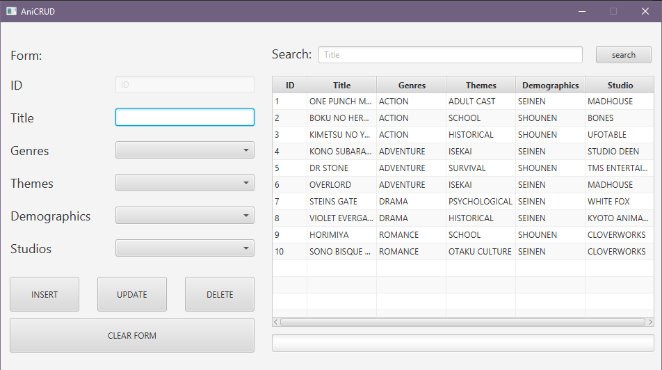
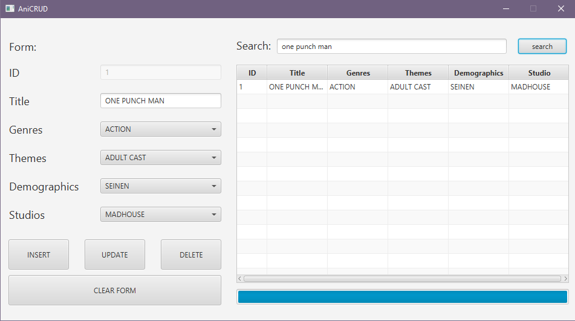
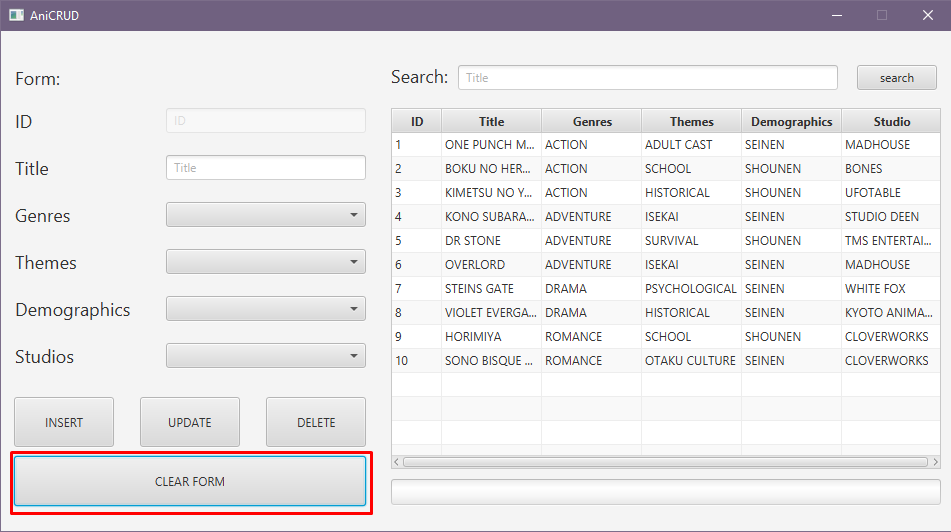
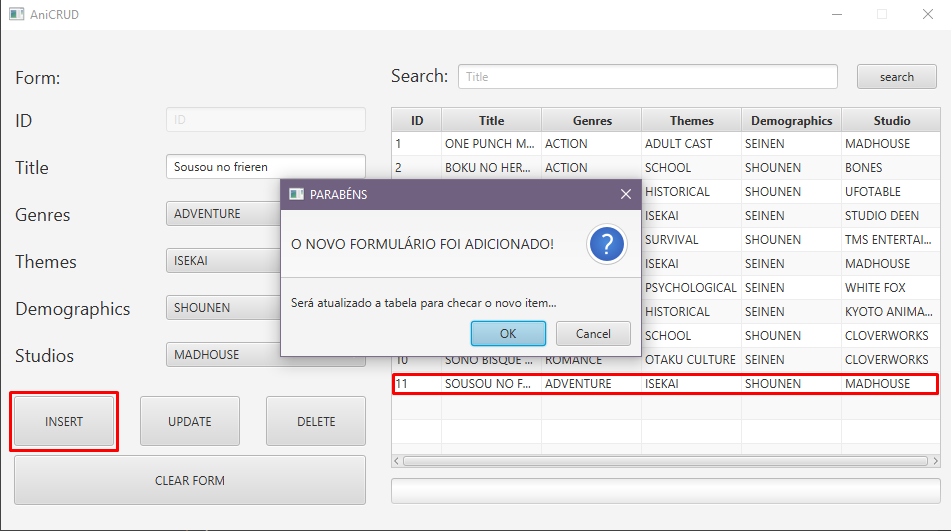
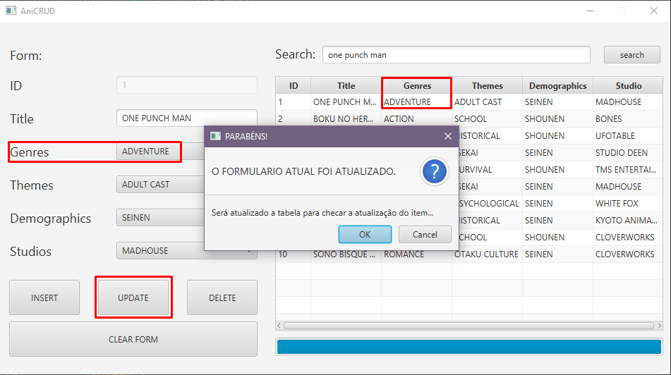
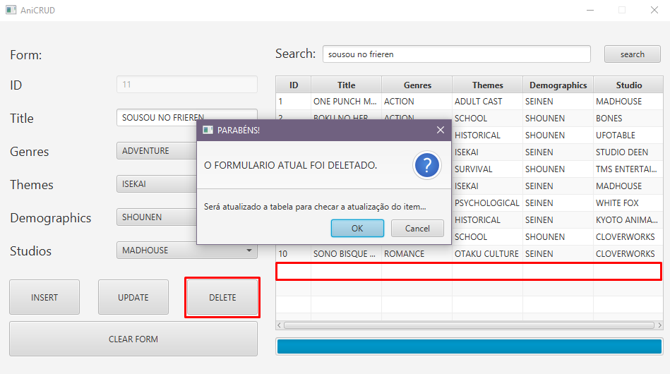

    

## Sobre o CRUD.

Este projeto consiste em um CRUD (Create, Read, Update, Delete) utilizando JavaFX para a interface gráfica e MySQL como banco de dados. O objetivo principal deste CRUD é permitir que o usuário gerencie as informações sobre animes de forma simples. 
Com este projeto, o usuário pode adicionar novos animes, visualizar os animes adicionados, assim como pesquisar sobre algum anime dentro da lista. Além disso, ele pode atualizar um anime e removê-lo da lista.

## Funcionalidades.

<h3>Barra de pesquisa.</h3>
É possível pesquisar por um anime ao inserir o título na barra de pesquisa e ao clicar no botão "search". Caso o usuário não insira corretamente, o sistema notifica o usuário. 

<h3>Limpando o formulário.</h3>
Ao clicar no botão "Clear form", ele limpa o formulário para preenchê-lo. 

<h3>Inserindo novo anime.</h3>
Você pode inserir um novo anime ao preencher os campos. Caso esqueça de preencher todos os campos, o próprio sistema informa. Além disso, se o anime já estiver na lista, o sistema retorna uma notificação informando que o anime já foi incluído. 

<h3>Atualizando o anime.</h3>
É possível atualizar o anime ao modificar os campos desejados e clicar no botão "update". 

<h3>Deletando o anime.</h3>
Caso você queira remover um anime, é possível através do botão "delete", porém é necessário preencher os campos de forma correta para que a exclusão não resulte em um erro. Para reduzir a possibilidade de erro, pode-se utilizar o botão de pesquisa para encontrar o anime na lista que deseja remover.

